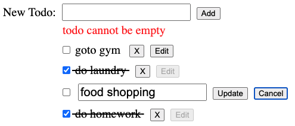

## Learning React Basics: Building a Todo App (CRUD)

### Part 1

- Understand the architecture of a React App
- Create and invoke a functional component (TodoList)

### Part 2

- Destructuring props property
- Pass Props data (array of objects) to a component
- How to reference props data in child component

### Part 3

- Using map to iterate through collection of elements and render results within JSX of component
- Learning about the DRY (Don't Repeat Yourself) software engineering prinicple in working with collections of data.
- Importance of "key" attribute in rendering list of items

### Part 4

- Import static data file into component (export and import)
- Learn about "component hierarchy" with parent and child(ren) components
- Applying the SRP (single-responsibility principle) software engineering principle in contructing components
- Creating a child component (Todo) to render individual todo objects

### Part 5

- Creating state data with useState hook (function component)
- Understanding component re-rendering (state change or props data)
- Pass state down via props and sharing state with child components
- Pass functions down via props to update state ("lifting state")
- Differences between state vs props (when to use one vs other)
- Working with event handers and forms

### Part 6

- Updating state with objects and arrays (e.g. shallow copy)
- Where to create state (child vs sibling) in components and why
- Reviewing again, how components re-render when a component "lifts" state from a parent component
- Creating a sibling component (TodoForm) to add a new todo object

### Part 7

- Conditionally rendering elements in a component (i.e. if, element variables, ternary, short circuit)
- Creating local state to toggle conditionally rendered elements  
- Understanding component composition

#### Note: All individual parts (1-7) are located in steps folder.